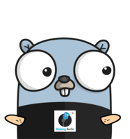

[](https://circleci.com/gh/alexfalkowski/go-signal)
[](https://codecov.io/gh/alexfalkowski/go-signal)
[](https://goreportcard.com/report/github.com/alexfalkowski/go-signal)
[](https://pkg.go.dev/github.com/alexfalkowski/go-signal)
[](https://masterminds.github.io/stability/active.html)

# go-signal

A library to handle signal handlers.

## Background

This library has been inspired by the following articles:

- <https://gobyexample.com/signals>
- <https://goperf.dev/01-common-patterns/context/>
- <https://pkg.go.dev/golang.org/x/sync/errgroup>

## Client

The client will start, run your app and stop. As an example:

```go
lc := signal.NewLifeCycle()
h := &signal.Hook{
    OnStart: func(context.Context) error {
        // Do something that starts.
        return nil
    },
    OnStop: func(context.Context) error {
        // Do something that stops.
        return nil
    },
}
lc.Register(h)

// Do something with err.
err := lc.Client(context.Background(), func(context.Context) error {
    // Your own app.
    return nil
})
```

## Server

The server will start, and wait for signal and stop. As an example:

```go
lc := signal.NewLifeCycle()
h := &signal.Hook{
    OnStart: func(context.Context) error {
        // Do something that starts.
        return nil
    },
    OnStop: func(context.Context) error {
        // Do something that stops.
        return nil
    },
}
lc.Register(h)

// Do something with err.
err := lc.Server(context.Background())
```
